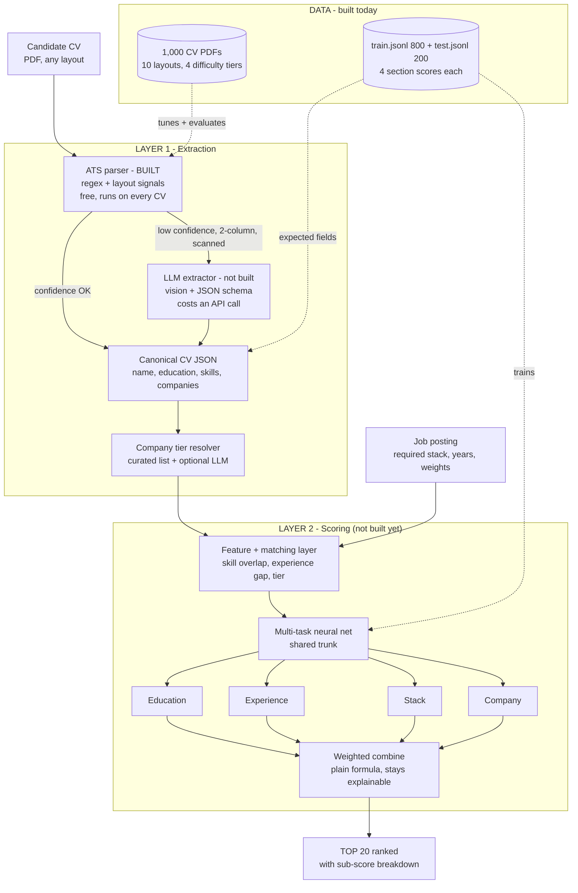
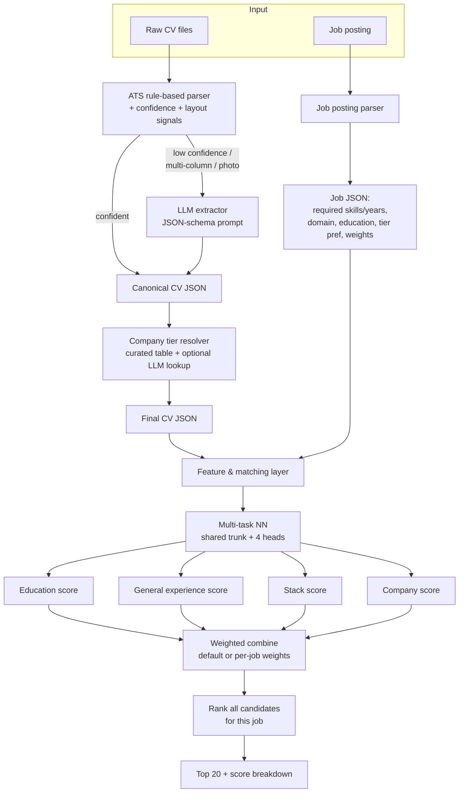
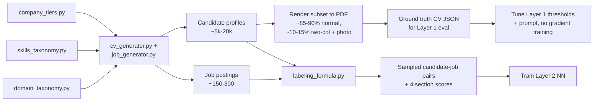

# ATS_AI — CV Screening & Top-20 Ranking System

## Workflow



The branch at Layer 1 is the cost decision: every CV goes through the free rule-based parser first, and only the ones it can't read confidently fall through to the LLM.

**Visual version of this diagram:** open [`docs/pipeline_map.html`](docs/pipeline_map.html) in any browser — the same pipeline drawn properly, plus the measured corpus difficulty. No sign-in, works offline.

Also published at https://claude.ai/code/artifact/2a86c156-7aa3-4040-9ab0-f63a2b888b7c — that one is private to the Claude account it was published from, so it only opens while signed into that account.

## Status

**Implemented:**
- Mock CV dataset generation (`data_layer1/gen/generate_mock_data.py` → `data_layer1/<split>/`).
- Visual CV rendering (`data_layer1/gen/render_cvs.py` + `cv_templates.py` + `cv_text.py` → `data_layer1/<split>/cvs_pdf/`) — every candidate also has a real PDF resume drawn from one of **ten distinct layouts**, graded by how hard it is to parse, including image-only "scanned" CVs with no text layer at all.

- **Layer 1 extraction** (`layer1_extraction/`) — the rule-based ATS parser, its confidence/escalation model, a field-level evaluation harness, and 44 unit tests.
- **Layer 2 data** (`data_layer2/`) — 250 synthetic job postings and 60,000 role-conditioned (candidate, job) pairs carrying the four section scores. See [`data_layer2/README.md`](data_layer2/README.md).

**Not yet built:** the LLM extraction fallback, the Layer 2 scoring model itself, and the end-to-end pipeline.

---

## Layer 1 results (held-out test split)

```
python -m layer1_extraction.code.tune --target 0.95     # fit escalation threshold on TRAIN
python -m layer1_extraction.code.evaluate --split test  # score on held-out TEST
pytest layer1_extraction/tests -q                            # 44 unit tests
```

| group | n | name | degree | skills F1 | jobs F1 | start date | yrs MAE | escalated |
|---|---|---|---|---|---|---|---|---|
| all | 200 | 93.5% | 94.0% | 95.7% | 94.9% | 97.9% | 0.36 | 6.0% |
| **all (text CVs)** | **188** | **99.5%** | **100%** | **98.9%** | **98.0%** | **97.9%** | **0.36** | **0%** |
| easy | 60 | 100% | 100% | 98.9% | 97.4% | 97.7% | 0.46 | 0% |
| medium | 50 | 100% | 100% | 98.0% | 100% | 98.9% | 0.12 | 0% |
| hard | 78 | 98.7% | 100% | 99.5% | 97.4% | 97.4% | 0.42 | 0% |
| scanned | 12 | 0% | 0% | 0% | 0% | 0% | — | 100% |

The two headline rows differ only in whether image-only CVs are included. Those carry no text at all, so they score zero on every field by construction and drag the raw average down; **all (text CVs)** is the meaningful figure for the parser, and the scanned row is the measure of how badly the LLM fallback is needed.

Skills run at **99.7% precision / 91.9% recall** and employers at **96.4% / 93.4%** — the parser still under-reads rather than inventing, which is the right failure direction when a downstream model consumes its output.

Escalation is **exactly** the 12 scanned CVs: every document with a text layer is parsed confidently, and every one without is handed on. Notably the **hard** tier (sidebars, two-column, table grids) now matches easy and medium on every field — reading order, not vocabulary, was what made those documents hard.

### What "training" means here

There is no gradient training — the parser is regex, section-header detection and a vocabulary lookup. The one fitted parameter is the **confidence threshold** for escalating a CV to the LLM extractor, chosen on the train split by `layer1_extraction/code/tune.py` and written to `layer1_extraction/code/config.json`. It is a cost/quality trade-off, not an accuracy maximiser:

| threshold | quality of kept parses | escalated |
|---|---|---|
| 0.00 | 94.1% | 0% |
| **0.05** | **97.4%** | **3.4%** |
| 0.85 | 96.0% | 43.4% |

The curve is flat from 0.05 to 0.70: the parser is either confident and right, or looking at a document with no text at all. The fitted threshold is the cheapest one clearing the target quality on train, and it escalates precisely the scanned CVs.

### How it handles the hard layouts

Each of these came from measuring a specific failure, not from guessing.

- **Reading order** — `pdfplumber` walks a page top-to-bottom, so a sidebar interleaves line-by-line into the job history. The column boundary is found from **raw word coverage** across x: a true gutter is a vertical band no word occupies. Deriving it from assembled lines is circular, because two columns sharing a baseline merge into one line that then appears to span the gutter. Each column is grouped and emitted whole.
- **Names** — taken from the **largest type on page one**, which is where every resume puts the name. Position is unreliable once a sidebar reorders the page; before this, sidebar CVs returned a city from the contact block.
- **Page furniture** — headers and footers are separated from the body, so contact details parked in a header (117 CVs) are still read rather than ignored, and page numbers don't pollute the sections.
- **Employer identification** — tier-3 employers are invented names, so lookup is useless. A job header is split on its separators and the part *without* a job-title keyword is the employer. This covers "Title, Employer", "Employer — Title", and grid layouts that put dates in their own column above the title. The employer line usually carries the dates and location too (`Adobe | February 2024 to Now | Berlin`), so only its leading field is judged — rejecting any line containing a date dropped whole jobs.
- **Fragmented skill rows** — tables and rating bars emit `Kubernetes` and `20 yrs` as separate lines, which reading order can strand far from the skills heading. A line that is *exactly* a known skill is a list entry, never prose, so these are recovered safely. Narrow columns also wrap mid-entry (`GCP (2` / `years)`), so the section is parsed both line-by-line and rejoined.
- **Broken glyphs** — symbol fonts without a Unicode map surface as `(cid:127)` or as an arbitrary letter (`n Vue.js`). The first is normalised to a bullet; for the second, the leading token is dropped only when the remainder is itself a known skill, which cannot invent one.
- **No skills section** — ~2% of CVs list no skills at all. Only for those, skills are read from the experience prose, which is what real applicant tracking systems do: a tool named in an achievement is a genuine claim to it. CVs *with* a skills section never mine prose.

---

## What the finished system will do

Given a job posting and a pool of candidate CVs, extract structured information from each CV and score it against that job on four sections — **Education**, **General Experience**, **Stack/Tech Experience**, **Company/Big-Tech Prestige** — plus an overall relevance score, then return the **top 20** candidates for that job.

Two layers:
- **Layer 1 (Extraction)** — turns a raw CV (any format/layout) into structured fields.
- **Layer 2 (Scoring)** — turns those structured fields (+ the job's requirements) into the four section scores and an overall score.

---

## Key design decisions

| Decision | Choice | Why |
|---|---|---|
| Layer 1 (extraction) engine | **Hybrid**: rule-based/ATS parser first, LLM fallback for low-confidence or irregular layouts | Cheap by default, only pays for an LLM call when the CV actually needs it |
| Layer 1 training | **No gradient training** — rule thresholds tuned against ground truth; LLM mode is prompt/schema-engineered | Neither approach needs backprop |
| Layer 2 (scoring) model | **Multi-task neural network**, shared trunk + 4 heads | Learns cross-section interactions (e.g. stack strength correlating with general experience) that 4 independent models would miss |
| Scoring context | **Role-conditioned** — the scorer takes the job's requirements as input, not just the CV | "Stack score" becomes "match to *this* job's required stack," which is what a real ranking tool needs |
| Layer 1 ↔ Layer 2 training | **Fully decoupled** | Synthetic ground truth exists for the intermediate structured fields, so each layer trains/evaluates against its own ground truth — easier to debug, no need for a differentiable pipeline |
| Dataset scale (v1 full system) | **Medium**: ~5,000–20,000 synthetic candidate profiles, ~150–300 synthetic job postings | Enough for a real neural net without a slow, hard-to-inspect generation step |
| CV document realism | **Ten distinct layouts** graded easy/medium/hard, plus a ~5% image-only scanned slice | One template teaches a parser nothing. Layout diversity — not sentence novelty — is what makes extraction hard, and the scanned slice is the only way to genuinely force the vision/LLM path |
| Company tier signal | **Curated static tier list** by default, with an **optional LLM lookup** (user-supplied key) scoped *only* to companies missing from the list | Keeps the tier signal fast/free/offline by default; the LLM is an isolated, optional enrichment plug-in |

---

## 1. Data (implemented)

The mock dataset is **role-agnostic** for now (no job postings yet — see the roadmap): every candidate gets an intrinsic 0–100 score per section, generated by a deterministic formula from their profile plus a little random noise (so scores aren't perfectly back-solvable from the visible fields).

**Candidate profile fields:** name (via `Faker`), education (1–2 degrees, each with `start_year`/`end_year`, institution and field), general experience (domain + years), skills (4–16, each with years), companies (each with title, tenure, `start_date`/`end_date`, tier).

Everything scales with career stage so the population is realistic rather than uniform:

| | junior (<3 yrs) | mid (3–8) | senior (8+) |
|---|---|---|---|
| share of candidates | ~22% | ~26% | ~29% at 10+ yrs |
| employers | 0–1 | 1–3 | 2–5 |
| skills listed | 4–7 | 7–11 | 10–16 |

Career length is drawn per band (`EXPERIENCE_BANDS`) rather than from a single curve, so fresh graduates and 20-year veterans are both properly represented instead of everything piling up in the middle.

Other coherence rules: jobs run reverse-chronologically from today with occasional gaps; title seniority tracks career stage (Junior → Senior → Lead/Principal); the current role is open-ended where the candidate is still employed; nobody graduates after their first job started; and **skills are drawn mostly from the candidate's own domain** (`DOMAIN_SKILLS`) with a minority of adjacent tools, so a DevOps engineer doesn't end up headlining LangChain.

**Score formulas** (`data_layer1/gen/generate_mock_data.py`):
- `education_score` — degree level base score × field desirability weight.
- `general_experience_score` — diminishing-returns curve on years in domain (`100·(1−e^(−years/8))`).
- `stack_score` — sum of per-skill contribution (years, capped at 6, × skill demand weight), passed through a diminishing-returns curve.
- `company_score` — tenure-weighted average of company tier (Tier 1=100, Tier 2=65, Tier 3=35).
- `overall_score` — equal-weighted average of the four (weights become configurable once Layer 2/job postings exist).

**Files:**
```
data/train.jsonl                800 full nested candidate records (authoritative labels)
data/test.jsonl                 200 full nested candidate records
data/train.csv                  800 flattened rows for quick viewing (Excel-friendly)
data/test.csv                   200 flattened rows
data/cvs_pdf/train/<id>.pdf     800 rendered resume PDFs, joined to the labels by id
data/cvs_pdf/test/<id>.pdf      200 rendered resume PDFs
data/cvs_pdf/manifest.csv       id, split, template, difficulty, pagesize, skill_mode,
                                skill_years_stated, scanned, pages, fallback, pdf_path
data/cvs_pdf/_layout_samples.pdf  thumbnail contact sheet of every layout, for eyeballing
```

**Row order is aligned across every file.** Ids are assigned *after* the shuffle and train/test split, so for any N:

```
train/train.jsonl line N  ==  train/train.csv row N  ==  train/cvs_pdf/TRAIN0000N.pdf
test/test.jsonl   line N  ==  test/test.csv   row N  ==  test/cvs_pdf/TEST0000N.pdf
```

So `TRAIN00001.pdf` is the first row of `train.csv`, and both are the same candidate. The same split feeds both models — Layer 1 is tuned and evaluated on the PDFs, Layer 2 trains on the structured fields those PDFs would yield under correct extraction, so a candidate never appears in one model's train set and the other's test set.

### 1.1 Document realism (why these are hard to parse)

The documents are what Layer 1 has to survive, so they vary the way real resumes do rather than repeating one template. Ten layouts — `classic_ats`, `modern_banner`, `minimal_centered`, `compact_boxed`, `academic_dense`, `table_grid`, `two_column_balanced`, `left_sidebar_dark`, `right_sidebar_light`, `europass_style` — each further randomised per document:

- **Fonts, accent colours, page size** (mix of A4 and letter), margins, uppercase vs title-case names.
- **Heading synonyms** — "Experience" / "Work Experience" / "Employment History" / "Career History"; "Skills" / "Core Competencies" / "Technical Proficiencies".
- **Section order** — juniors lead with education and projects, seniors lead with experience (the convention real resume guidance recommends).
- **Six date formats** — `Mar 2019 – Aug 2021`, `03/2019 - 08/2021`, `2019–2021`, `March 2019 to Present`, `Mar '19 – Aug '21`. Tenure must be *computed*, not read. Education carries from–to ranges too, and ~22% show only the finish year.
- **Eight ways of presenting skills** — only ~20% state years explicitly (`Python (7 yrs)`); the rest are bare lists, category groupings, proficiency words, rating bars with no text at all, or a bordered **Skill | Years table**. The `skill_years_stated` manifest column marks which is which, so evaluation can be fair.
- **Tapered achievement bullets** — 3–5 quantified lines on the most recent role, falling to 1–2 on older ones, with the metrics real engineering CVs quote (p99 latency, deploy frequency, uptime, cost, users served). Bullets only name skills the candidate holds, and only where the skill family fits the claim.
- **Depth that scales with seniority** — thesis titles and relevant coursework for recent graduates, publications for PhDs, certifications with issuer and year, career-highlight blocks for seniors, projects (which juniors lean on and seniors mostly drop).
- **Filler sections** a parser must *not* mistake for the real fields — certifications, languages, interests, awards, volunteering, "References available upon request".
- **Page headers and footers** — 117 CVs put contact details *only* in a page header, which most ATS parsers ignore entirely; flagged as `contact_in_header_only` in the manifest.

Length follows seniority the way real CVs do: **841 one-page** and **159 two-page** documents, with the two-pagers concentrated among candidates with 8+ years.

Difficulty tiers in the manifest: **easy** (301) plain linear layouts · **medium** (287) styled but linear · **hard** (373) sidebars, true multi-column, and table grids that scramble naive reading order · **scanned** (39) rasterised, skewed and noised into image-only PDFs.

Measured with `pdfplumber` on 30 CVs per tier — characters recovered and how often ground-truth fields appear in the extracted text:

| difficulty | chars extracted | name found | all employers found | job year found |
|---|---|---|---|---|
| easy | 1,654 | 83% | 100% | 90% |
| medium | 1,589 | 60% | 100% | 93% |
| hard | 1,414 | 96% | 100% | 93% |
| **scanned** | **0** | **0%** | **6%** | **6%** |

Note that "hard" scoring *higher* on name recovery than "easy" is expected: the tiers describe **reading-order** difficulty, not character recovery. A sidebar CV yields plenty of text — it just yields it in an order that makes the fields hard to associate correctly, which flat extraction-rate checks don't capture. The low name rate on "medium" comes from uppercase names, and the sub-100% job-year rates from `Mar '19` two-digit formats. All deliberate.

Scanned CVs defeat text extraction completely — they exist specifically to force the vision/LLM fallback path. The sub-100% name and date rates on the other tiers are deliberate too (uppercase names, `Mar '19` two-digit years), not defects.

Company *tier* is never printed on a document — a real resume doesn't state its own prestige — so Layer 1 must resolve tier from the employer name, exactly as in production.

Regenerate with:
```
cd data_layer1/gen
python generate_mock_data.py --n 1000 --train-frac 0.8 --seed 42
python render_cvs.py --scanned-frac 0.04 --seed 42     # --limit N for a quick subset
```

---

## 2. Layer 1 — Extraction (not yet built)

**Canonical output schema** (target for every extraction path):
```
{ name, education: [{degree, field, institution, grad_year}],
  general_experience: {domain, total_years},
  skills: [{name, years}],
  companies: [{name, title, start_date, end_date, tier}] }
```

- **Resource-saving mode (ATS-style, default, no training):** rule-based parsing via `pdfplumber`/`python-docx` + regex/section-header heuristics, plus layout signals (column detection, embedded-image detection) feeding a confidence score.
- **Precise/AI mode (LLM fallback):** triggered on low confidence or a detected multi-column/photo layout. Sends the CV to an LLM with a strict JSON-schema/tool-call prompt matching the canonical schema. No fine-tuning needed — the work is prompt design + schema validation, not gradient training.
- **Company tier resolution:** exact/fuzzy match against a curated table first; if unmatched *and* an LLM key is configured for this specific purpose, ask the LLM to classify the tier (cached). Otherwise default to Tier 3 with a low-confidence flag.

## 3. Layer 2 — Scoring (not yet built)

Role-conditioned multi-task neural network. Four input branches (Stack, Education, General Experience, Company), each combining a candidate-side and job-side representation (e.g. learned skill embeddings, years-weighted pooling, matched against the job's required skills/years), feeding a **shared trunk**, then branching into **4 regression heads** (0–100), trained with Huber loss against synthetic labels.

**Overall score** = a transparent, configurable weighted sum of the 4 heads (not a 5th learned head), so a recruiter can always see *why* a candidate ranked where they did. Top 20 = highest overall score in the candidate pool for that job.

Trained/evaluated with a **job-level** train/val/test split. Metrics: per-section MAE/RMSE, plus ranking metrics (NDCG@20, Precision@20, Spearman correlation).

*Why train a model when labels come from a formula?* In production, Layer 2 never sees clean synthetic features — it sees Layer 1's output, which can be noisy or partially missing. A trained network generalizes smoothly and degrades gracefully on incomplete input in a way a brittle if/else formula doesn't, and gives a natural place to later swap in real recruiter feedback as labels.

## 4. Runtime pipeline (target architecture)



## 5. Offline data & training pipeline (target architecture, full version with job postings)



## 6. Repo structure

```
data_layer1/           Layer 1 data - CV documents + extraction labels
  gen/                 generate_mock_data.py, render_cvs.py, cv_templates.py, cv_text.py
  train/               labels + manifest + cvs_pdf/   (800)
  test/                labels + manifest + cvs_pdf/   (200)

data_layer2/           Layer 2 data - role-conditioned scoring
  gen/                 scoring_rules.py, generate_layer2_data.py
  train/               200 jobs, 50,000 scored pairs
  test/                50 jobs, 10,000 scored pairs

layer1_extraction/     Layer 1 code
  code/                schema, pdf_text, ats_parser, vocab, metrics, dataset, tune, evaluate
  tests/               44 unit tests

layer2_scoring/        Layer 2 code (not built yet)
  code/
  tests/

docs/                  pipeline_map.html
```

## 7. Build order (remaining phases)

1. ~~Mock CV data~~ ✅
2. ~~Render CVs to PDF (ten layouts, graded difficulty, scanned subset)~~ ✅
3. Job posting generator + role-conditioned labeling formula → Layer 2 training pairs
4. Layer 2 model, training, evaluation
5. ~~ATS rule-based parser + confidence/layout signals, evaluated against `data_layer1/`~~ ✅
6. LLM extraction fallback + LLM company-tier enrichment
7. `pipeline.py` end-to-end CLI
8. Iterate on metrics and tune thresholds/weights
