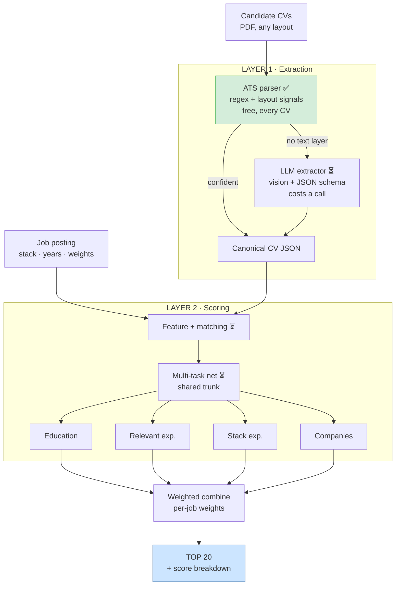
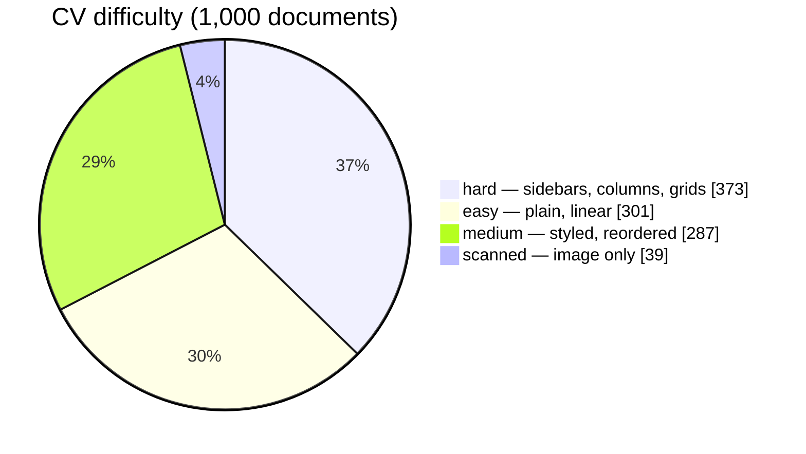
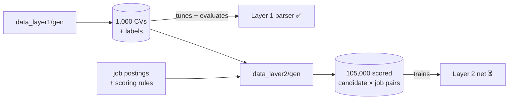

# ATS_AI — CV Screening & Top-20 Ranking

Given a job posting and a pool of CVs, extract structured fields from each CV,
score it against that job on four sections, and return the **top 20**.



✅ built · ⏳ not yet

**Visual version:** [`docs/pipeline_map.html`](docs/pipeline_map.html) — open in any browser.

---

## Status

| | built | detail |
|---|---|---|
| CV corpus — 1,000 PDFs, 10 layouts | ✅ | [`data_layer1/`](data_layer1/README.md) |
| Layer 1 parser + eval, 44 tests | ✅ | [`layer1_extraction/`](layer1_extraction/README.md) |
| Scoring data — 570 jobs, 105k pairs | ✅ | [`data_layer2/`](data_layer2/README.md) |
| Layer 2 loader, 18 tests | ✅ | `layer2_scoring/code/dataset.py` |
| LLM extraction fallback | ⏳ | |
| Layer 2 multi-task net | ⏳ | |
| End-to-end pipeline | ⏳ | |

---

## Layer 1 results — held-out test

| tier | n | name | degree | skills F1 | jobs F1 | dates |
|---|---|---|---|---|---|---|
| **text CVs** | **188** | **99.5%** | **100%** | **98.9%** | **98.0%** | **97.9%** |
| easy | 60 | 100% | 100% | 98.9% | 97.4% | 97.7% |
| medium | 50 | 100% | 100% | 98.0% | 100% | 98.9% |
| hard | 78 | 98.7% | 100% | 99.5% | 97.4% | 97.4% |
| scanned | 12 | 0% | 0% | 0% | 0% | 0% |

Escalation to the LLM is **exactly** the 12 scanned CVs — every document with a
text layer parses confidently. Skills 99.7% precision, jobs 96.4%.

---

## Corpus



| | |
|---|---|
| layouts | 10 hand-designed templates |
| length | 841 one-page · 159 two-page |
| traps | 117 contact-in-header · 118 skills-as-table · 796 skill-years implicit |
| alignment | `train.jsonl` line N ↔ `cvs_pdf/TRAIN0000N.pdf` |

---

## Data flow



---

## Structure

```
data_layer1/        gen/ · train/ · test/          CV documents + extraction labels
data_layer2/        gen/ · train/ · test/          job postings + scored pairs
layer1_extraction/  code/ · tests/                 the parser
layer2_scoring/     code/data/ · code/training/ · tests/   the scorer
docs/               pipeline_map.html
```

---

## Run

```bash
# data
cd data_layer1/gen && python generate_mock_data.py --n 1000 --seed 42
cd data_layer1/gen && python render_cvs.py --seed 42
cd data_layer2/gen && python generate_layer2_data.py --seed 42

# layer 1
python -m layer1_extraction.code.tune --target 0.95      # fit on TRAIN
python -m layer1_extraction.code.evaluate --split test   # score on TEST

# layer 2 - loading (built)
python -m layer2_scoring.code.data.dataset               # inspect splits
python -m layer2_scoring.code.data.torch_data            # inspect a tensor batch

# layer 2 - model and loops (placeholders, not implemented)
python -m layer2_scoring.code.training.model             # what a batch looks like
python -m layer2_scoring.code.training.train             # what the loop gets
python -m layer2_scoring.code.training.evaluate          # what the pools look like

pytest -q                                                # 70 tests
```

---

## Key decisions

| | choice | why |
|---|---|---|
| Layer 1 engine | rules first, LLM fallback | cheap by default; pays only when the CV needs it |
| Layer 1 training | none (threshold fitted) | regex and lookups don't need backprop |
| Layer 2 model | multi-task net, 4 heads | learns cross-section interactions |
| Scoring | role-conditioned | "stack" means *this* job's stack |
| Layers | fully decoupled | each trains against its own ground truth |
| Overall score | plain weighted sum | stays explainable to a recruiter |
| Employer tier | curated list, LLM for unknowns only | fast and free by default |

---

## Roadmap

- [x] CV corpus + rendered documents
- [x] Layer 1 parser, threshold fitting, evaluation
- [x] Job postings + role-conditioned labels
- [x] Layer 2 data loader
- [ ] Layer 2 multi-task net — train + evaluate (NDCG@20)
- [ ] LLM extraction fallback for scanned CVs
- [ ] `pipeline.py` — CVs + job → top 20
